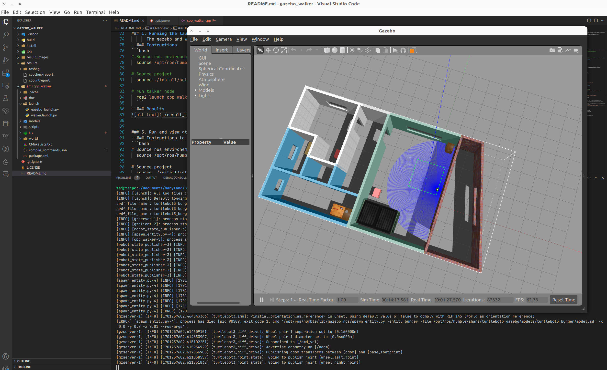

# beginner_tutorials

[](https://opensource.org/licenses/Apache-2.0)
---
# Overview:
 * This repository demostrates walker algorithm for turtlebot3 in a closed environments
    - "cpp_walker" package containts the walker algorithm and a gazebo launch scripts. 


## Developer:
 - Tej Kiran 
    - UID: 119197066

## Dependencies/Requirements: 
 - Laptop
 - Ubuntu 22.04 or higher
 - VS Code/Terminal
 - ROS 2 Humble

## How to build
``` bash
# Source ros environemnt
  source /opt/ros/humble/setup.bash
# Cloning the repository
  git clone <repo-link>
# cd to repository
  cd  gazebo_walker
# Compile and build the project:
  colcon build
#
```

## Instructions to run static code analysis:
 ```bash
 # Navigate to workspace folder
 cd  gazebo_walker

 # run the following command
 cppcheck --enable=all --std=c++17 ./src/cpp_walker/src/*.cpp --suppress=missingIncludeSystem --suppress=missingInclude --suppress=unmatchedSuppression > ./results/cppcheckreport

 # The report can be viewed at ./beginner_tutorials/results/cppcheckreport

 ```

## Instructions to check Google Style:
 
```bash
 # Navigate to workspace folder
  cd  gazebo_walker

#  run the following command
 cpplint --filter=-build/c++11,+build/c++17,-build/namespaces,-build/include_order ./src/cpp_walker/src/*.cpp   > ./results/cpplintreport > ./results/cpplintreport

 # The report can be viewed at ./beginner_tutorials/results/cpplintreport
 ```

## Instructions to generate doxygen documentation:

```bash
# Navigate to doc folder in package
 cd  gazebo_walker/src/cpp_walker/doc
 
# Run the following command
 doxygen

 # To see the documentation
 cd gazebo_walker/src/cpp_walker/doc/html
 firefox index.html
 ```


## How to run the demo
### 1. Running the launch file
      The gazebo and walker nodes can be launched from the launch file using the below steps.
- ### Instructions
```bash
# Source ros environemnt
  source /opt/ros/humble/setup.bash

# Source project
  source ./install/setup.bash

# run walker and gazebo
  ros2 launch cpp_walker walker.launch.py
  
# run with rosbag record
ros2 launch cpp_walker walker.launch.py is_record_bag:=true bag_file_path:=rosbag/walker
```
- ### Results


- ### Demo Video
https://github.com/itej89/gazebo_walker/assets/37236721/fb86e5e2-3281-43d7-b174-58cf315adaaf


### 2. Instructions to launch ros2 bag playback
```bash
  # Source ros environemnt
  source /opt/ros/humble/setup.bash

  # Source project
  source ./install/setup.bash

  # Launch file to playback the bag-file and listener
  ros2 launch cpp_walker rosbag_replay_launch.py bag_file_path:=rosbag/walker
```

- ### ros2 bag playback results


## Dependency Installation: 
- ROS 2 Humble:
  - Follow the below website instructions to install ROS 2 Humble based on your Ubuntu version
    - Ubuntu 22.04:
      - https://docs.ros.org/en/humble/Installation/Ubuntu-Install-Debians.html#install-ros-2-packages
    - Gazebo Installation Instructions
    ```bash
    # Add the ROS 2 GPG key with apt
    sudo apt update && sudo apt install curl -y
    sudo curl -sSL https://raw.githubusercontent.com/ros/rosdistro/master/ros.key -o /usr/share/keyrings/ros-archive-keyring.gpg

    # Then add the repository to your sources list.
    echo "deb [arch=$(dpkg --print-architecture) signed-by=/usr/share/keyrings/ros-archive-keyring.gpg] http://packages.ros.org/ros2/ubuntu $(. /etc/os-release && echo $UBUNTU_CODENAME) main" | sudo tee /etc/apt/sources.list.d/ros2.list > /dev/null

    # update package database
    sudo apt update
    sudo apt -y upgrade

    # install ROS2 Desktop (Full)
    sudo apt -y install ros-humble-desktop-full

    # install ROS2 gazebo and turlebot3 packages
    sudo apt -y install ros-humble-gazebo-ros-pkgs
    sudo apt -y install ros-humble-turtlebot3*
    sudo apt -y install ros-humble-turtlebot4-desktop

    # install colcon tab completion 
    sudo apt -y install python3-colcon-common-extensions
    ```

## References
- Gtest integration into ROS2
  - https://github.com/TommyChangUMD/minimal-integration-test
